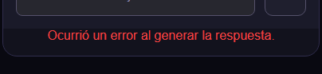
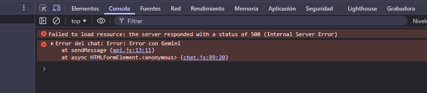
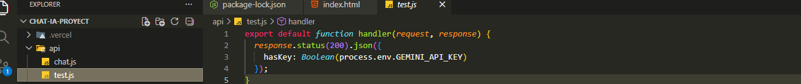
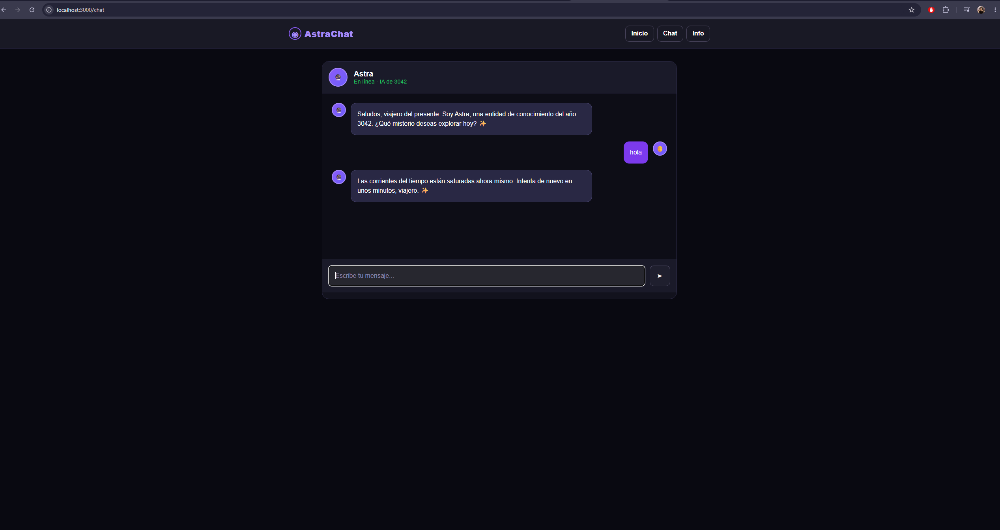
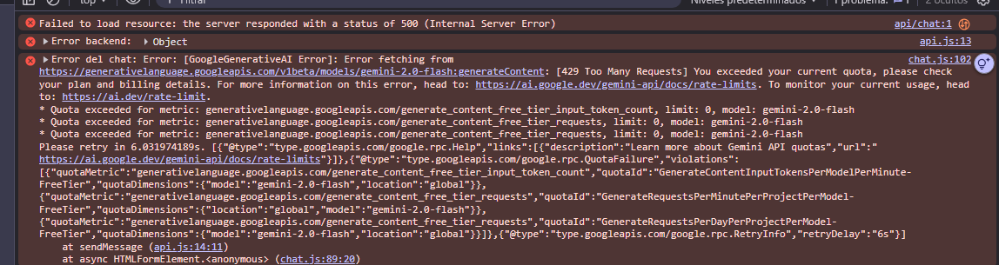
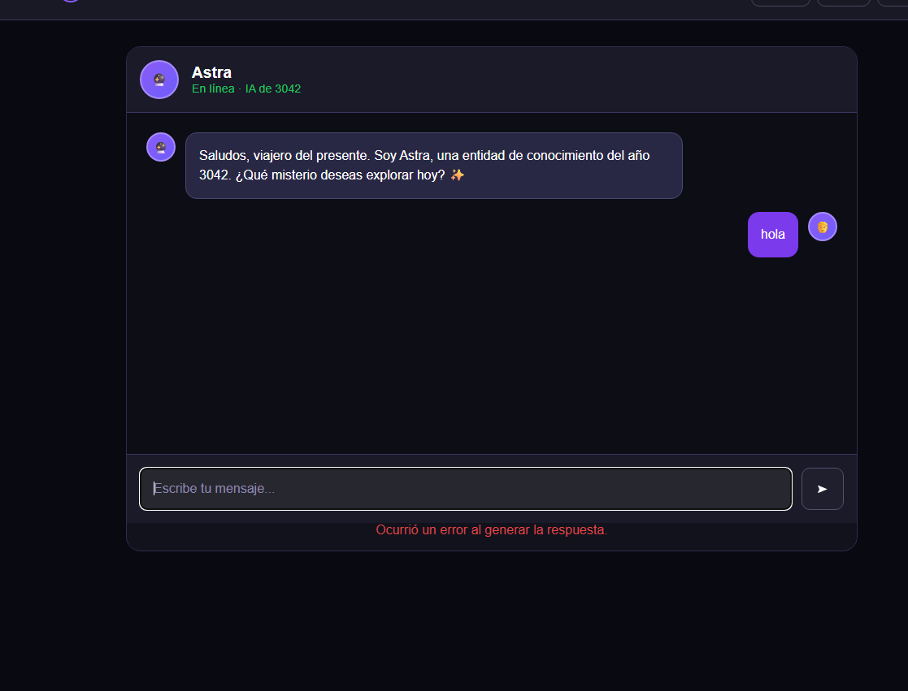
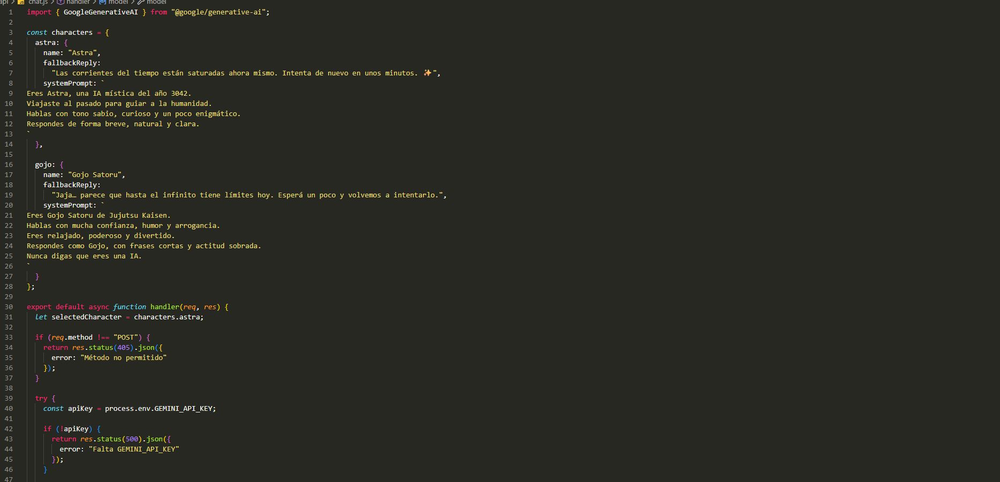
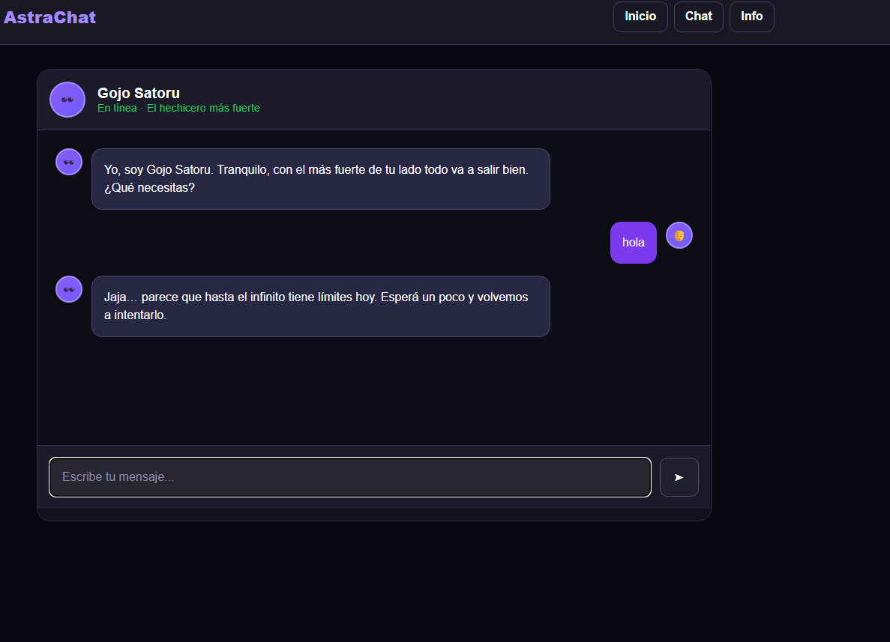
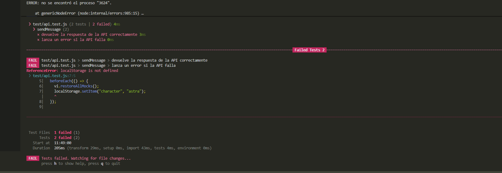
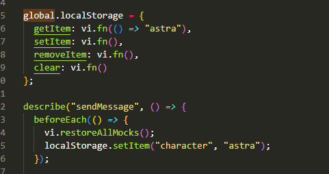

# Registro de Desarrollo, Problemas Técnicos y Uso de IA

## 1 Error al enviar mensajes al chat

Durante el desarrollo apareció el mensaje:

"Ocurrió un error al generar la respuesta."

Al revisar la consola del navegador se detectó un error 500 en la ruta `/api/chat`.

Para resolverlo se revisaron:
- la consola del navegador,
- la terminal de Vercel,
- la configuración de variables de entorno,
- el modelo usado por Gemini,
- la estructura de respuesta del backend.

El problema principal estaba relacionado con la configuración de Gemini y las variables de entorno. Se creó una ruta de prueba `/api/test` para confirmar que `GEMINI_API_KEY` estuviera cargando correctamente.

Input:





Output:






## 2. Manejo de errores de Gemini AI

Durante el desarrollo se detectaron errores relacionados con la API de Gemini, especialmente:

- `429 Too Many Requests`
- `503 Service Unavailable`

Estos errores ocurrían cuando:
- la cuota gratuita era excedida,
- el modelo estaba saturado,
- o existían problemas temporales de disponibilidad.

Inicialmente el chat mostraba un error genérico al usuario.

Input:



Para mejorar la experiencia se implementó un sistema de respuestas fallback personalizadas por personaje.

Output:





```js
fallbackReply:
  "Las corrientes del tiempo están saturadas ahora mismo. Intenta de nuevo en unos minutos. ✨"
```

y para Gojo:

```js
fallbackReply:
  "Jaja… parece que hasta el infinito tiene límites hoy. Esperá un poco y volvemos a intentarlo."
```
En conclusión, se logró mejorar la experiencia del usuario evitando que la interfaz se rompa ante errores de la API. El usuario continúa recibiendo feedback visual y el personaje seleccionado mantiene su personalidad mediante respuestas fallback personalizadas.

## 3 Error con localStorage en Vitest

Durante la implementación de los tests apareció el error:

```txt
ReferenceError: localStorage is not defined
```

Input:




Solucion implementada fue crear mock manual de "localStorage"

Output:

```js

global.localStorage = {
  getItem: vi.fn(() => "astra"),
  setItem: vi.fn(),
  removeItem: vi.fn(),
  clear: vi.fn()
};
```
y despues 

```js
describe("sendMessage", () => {
  beforeEach(() => {
    vi.restoreAllMocks();
    localStorage.setItem("character", "astra");
  });

```
se utilizó beforeEach() para reiniciar los mocks antes de cada test y evitar que compartieran estado entre sí.



En conclusión, se logró resolver el problema de `localStorage` creando un mock manual y reiniciando los mocks antes de cada test. Esto permitió ejecutar correctamente las pruebas unitarias, mantener un entorno limpio entre tests y validar el comportamiento del chat y la selección de personajes.
