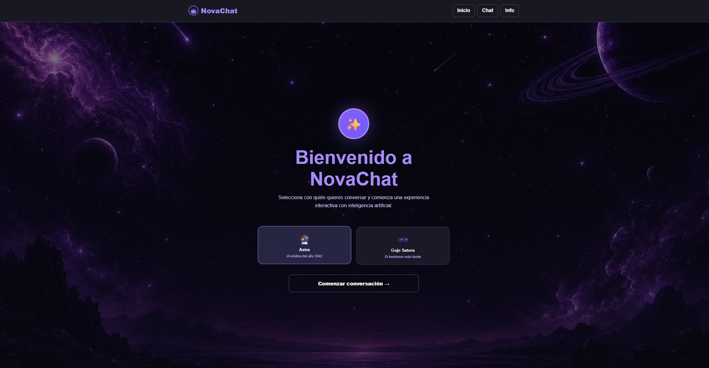
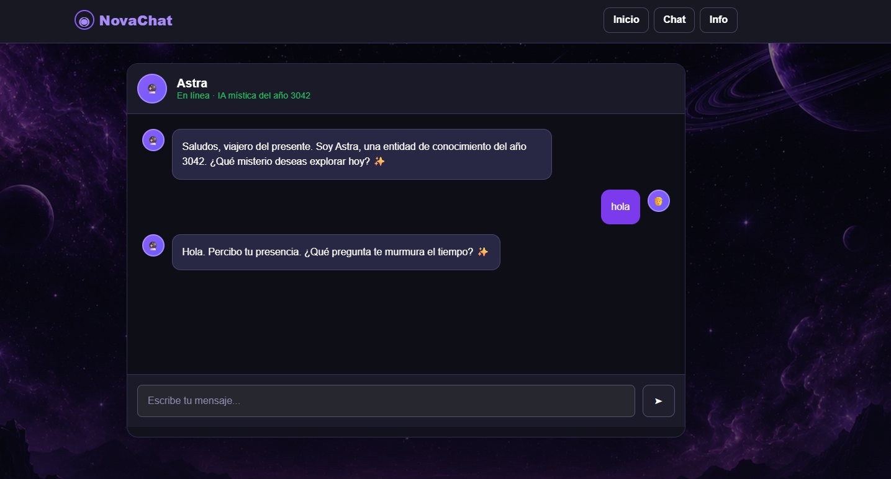
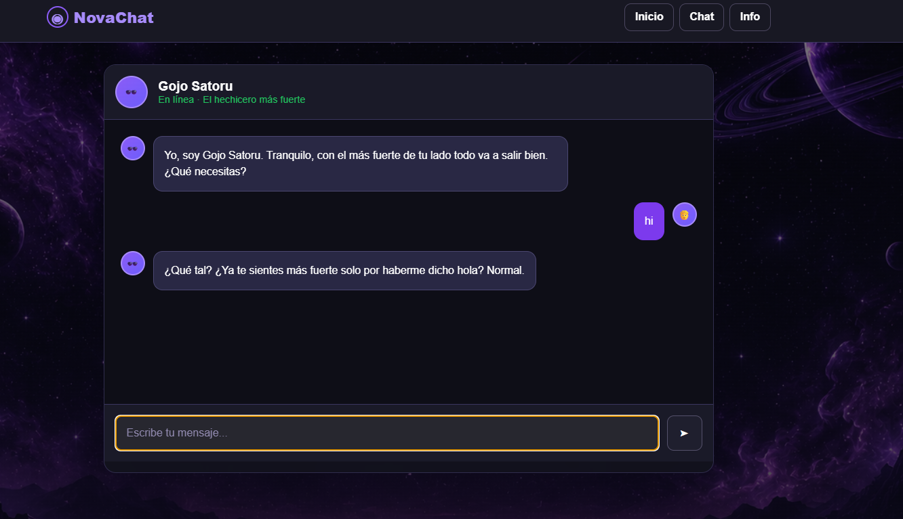
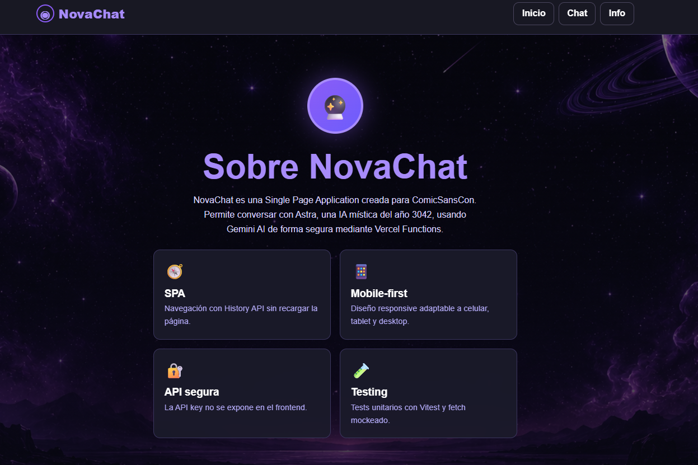
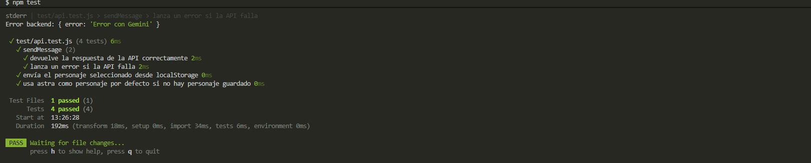

# NovaChat

NovaChat es una Single Page Application responsive donde los usuarios pueden elegir un personaje ficticio y conversar con él usando Gemini AI mediante Vercel Serverless Functions.

## Link del proyecto

- Aplicación desplegada: https://proyecto-m3-ia-chat.vercel.app
- Repositorio: https://github.com/juampxarnez-ctrl/Proyecto-M3-ArnezJuan.git

## Personajes

### Astra
IA mística del año 3042. Habla con tono sabio, curioso y enigmático.

### Gojo Satoru
Personaje inspirado en Jujutsu Kaisen. Habla con confianza, humor y actitud relajada.

## Tecnologías

- HTML
- CSS
- JavaScript
- Vite
- Gemini AI
- Vercel Serverless Functions
- Vitest

## Instalación local

```bash
git clone https://github.com/juampxarnez-ctrl/Proyecto-M3-ArnezJuan.git
cd chat-ia-proyect
npm install
```

## Variables de entorno

Crear un archivo `.env.local` en la raíz del proyecto:

```env
GEMINI_API_KEY=tu_api_key
```

También se puede crear un `.env` con:

```env
GEMINI_API_KEY=
```

## Ejecutar localmente

Para usar solo Vite:

```bash
npm run dev
```

Para probar también las Serverless Functions:

```bash
npx vercel dev
```

## Tests

El proyecto incluye tests unitarios con Vitest y mock de `fetch`.

```bash
npm test
```

## Deploy en Vercel

1. Subir el proyecto a GitHub.
2. Importar el repositorio en Vercel.
3. Agregar la variable de entorno `GEMINI_API_KEY`.
4. Ejecutar el deploy.
5. Verificar `/home`, `/chat` y `/about`.

## Funcionalidades

- Routing SPA con History API.
- Vistas `/home`, `/chat` y `/about`.
- Diseño mobile-first responsive.
- Selector de personajes.
- Chat con diferenciación visual entre usuario y personaje.
- Estado de “escribiendo...”.
- Manejo de errores de API.
- Integración segura con Gemini mediante Vercel Functions.
- Tests con Vitest.

## Capturas

### Home



### Chat con Astra



### Chat con Gojo



### About



### Tests



## Autor

Juan Pablo Arnez